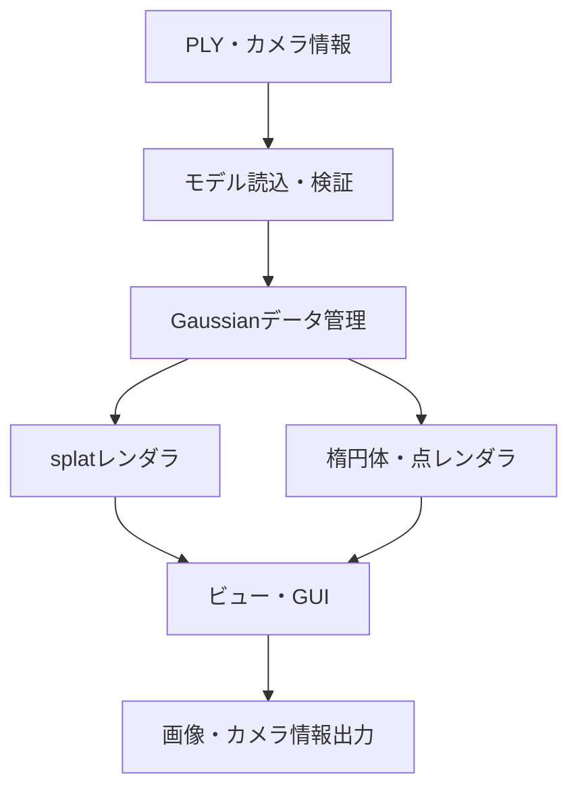

# 3DGS Gaussian可視化ツール 仕様書

最終更新日：2026年8月8日  
対象：3D Gaussian Splatting実装プロジェクト  
文書状態：第1.1版

## 1. 目的

本ツールは、3D Gaussian Splatting（3DGS）によって生成されたGaussian群を対話的に可視化し、学習結果の確認および実装のデバッグを支援するデスクトップアプリケーションである。

通常のsplatレンダリングによる新規視点画像だけでなく、各Gaussianを中心位置、回転、スケールに対応する3D楕円体として表示する。さらに、Gaussianの選択、パラメータ表示、フィルタリング、学習反復間の比較を可能にし、次の事項を確認できるようにする。

- Gaussianがシーンのどこに配置されているか
- Gaussianの大きさと異方性が適切であるか
- 不透明度や色がどのように分布しているか
- 不要なGaussianや極端なパラメータを持つGaussianが存在しないか
- 学習の進行に伴ってGaussian群がどのように変化したか
- 実装したレンダラの結果が保存済みモデルと整合しているか

## 2. 適用範囲

### 2.1 対象範囲

- 静的シーンを表現する3DGSモデルの読み込み
- Gaussianのsplat表示、楕円体表示および点表示
- 自由視点でのカメラ操作
- 入力カメラおよびSfM点群の重畳表示
- Gaussianの選択とパラメータ確認
- Gaussianの属性に基づく色分けとフィルタリング
- 学習反復ごとのモデル切り替え
- 表示画像およびカメラ情報の保存
- 描画時間、FPS、Gaussian数などの統計表示

### 2.2 初版の対象外

- Gaussianパラメータの編集および学習済みPLYへの上書き
- 学習処理そのものの実行
- 複数ユーザによる共同編集
- 4DGSなど、時間変化するGaussianの再生
- HoloLens 2およびOpenXRへの直接出力
- メッシュへの変換
- 音源位置や音響情報の重畳

4DGS、AR表示および音響情報との統合を将来拡張とし、初版では静的3DGSの可視化とデバッグを優先する。

本仕様書はGaussian可視化ツールの将来実装に対する仕様であり、PyTorchによる3DGS初期コア実装の実装範囲には含めない。

## 3. 想定利用者

- 3DGSを実装・検証する開発者
- 学習結果を観察する研究者
- 3DGSの内部表現を学習する学生

## 4. 用語

| 用語 | 定義 |
| --- | --- |
| Gaussian | 中心位置、回転、3軸スケール、不透明度、球面調和係数を持つ3D Gaussianである。 |
| splat表示 | Gaussianを画像平面上の2D Gaussianへ投影し、深度順にアルファ合成する表示方式である。 |
| 楕円体表示 | 3D共分散に対応する楕円体を三次元空間内に描画する表示方式である。 |
| 点表示 | Gaussianの中心位置のみを点として描画する表示方式である。 |
| raw値 | PLYまたは学習処理内部に保存された、活性化関数適用前の値である。 |
| 実値 | raw値に活性化関数を適用し、描画に使用できる形へ変換した値である。 |
| 入力カメラ | 学習画像の撮影に用いたカメラである。 |

## 5. 前提と設計方針

1. 3DGS本体と可視化ツールは、Gaussianのデータ構造、活性化関数、球面調和基底および座標系の規約を共有する。
2. モデルの読み込みと表示を学習処理から分離し、学習済みモデルのみでも起動できるようにする。
3. 見た目の確認だけでなく、Gaussian単位で内部パラメータを追跡できるデバッグツールとする。
4. 大量のGaussianを扱うため、楕円体は個別のCPU描画ではなくGPUインスタンシングによって描画する。
5. 表示条件の変更は元のモデルを変更しない。フィルタは非破壊的な表示マスクとして実装する。
6. 公式実装のPLY形式を優先的に受け付け、独自実装の出力も同じ形式へ揃える。

## 6. システム構成



### 6.1 構成要素

| 構成要素 | 責務 |
| --- | --- |
| モデルローダ | PLY、カメラ情報およびSfM点群を読み込み、形式を検証する。 |
| Gaussianデータ管理 | raw値と実値、表示マスク、選択状態、GPUバッファを管理する。 |
| splatレンダラ | 3DGS本体と同じ投影・ソート・アルファ合成によって画像を生成する。 |
| ジオメトリレンダラ | Gaussian中心、楕円体、座標軸、カメラおよびSfM点群を描画する。 |
| カメラ制御 | FPS方式、Orbit方式および入力カメラへの移動を管理する。 |
| GUI | 表示モード、色、フィルタ、選択情報、統計および入出力操作を提供する。 |
| エクスポータ | スクリーンショット、カメラパラメータおよび表示設定を保存する。 |

## 7. 入力仕様

### 7.1 学習済みモデル

主要入力は、公式実装と互換性のあるPLYファイルとする。

主要入力形式は公式実装と同じbinary little endianのPLYとする。検査用に出力されたASCII形式のPLYも読み込み対象とし、いずれの形式でも同一の属性名と意味を用いる。

```text
<model_path>/
└── point_cloud/
    ├── iteration_7000/
    │   └── point_cloud.ply
    └── iteration_30000/
        └── point_cloud.ply
```

PLYの`vertex`要素から、次の属性を読み込む。

| 属性 | 要素数 | 内容 | 読み込み後の処理 |
| --- | ---: | --- | --- |
| `x`, `y`, `z` | 3 | 世界座標系の中心位置 $\boldsymbol{p}_{\mathrm w}$ | そのまま使用する。 |
| `nx`, `ny`, `nz` | 3 | 公式形式との互換性を維持するためのplaceholder | 初版では使用しない。 |
| `f_dc_0`～`f_dc_2` | 3 | 0次の球面調和係数 | RGB色またはSH評価に使用する。 |
| `f_rest_*` | $3((l_{\max}+1)^2-1)$ | 1次以上の球面調和係数 | 視線方向に応じた色計算に使用する。 |
| `opacity` | 1 | 不透明度のraw値 $\widetilde{\alpha}$ | $\alpha=\operatorname{sigmoid}(\widetilde{\alpha})$ とする。 |
| `scale_0`～`scale_2` | 3 | スケールのraw値 $\widetilde{\boldsymbol{s}}$ | $\boldsymbol{s}=\exp(\widetilde{\boldsymbol{s}})$ とする。 |
| `rot_0`～`rot_3` | 4 | 回転を表す四元数のraw値 | 読み込み後に正規化する。成分順は3DGS本体と統一する。 |

`f_rest_*`の数から $l_{\max}$ を求める。値が整数次数に対応しない場合は読み込みエラーとする。初版で対応する最大次数は $l_{\max}=3$ とする。

`opacity`、`scale_*`および`rot_*`は、活性化または正規化後の表示値ではなく、3DGS本体が学習パラメータとして保持するraw値として解釈する。

### 7.2 カメラ情報

次のいずれかを読み込めるようにする。

- 3DGSモデルディレクトリ内のカメラ情報
- COLMAPの`cameras.bin`、`images.bin`および`points3D.bin`
- 独自実装が出力するJSON形式のカメラ情報

内部表現では、各カメラについて次の値を保持する。

- カメラIDおよび画像名
- 画像幅と画像高さ
- 焦点距離 $f_x,f_y$
- 主点位置 $c_x,c_y$
- 世界座標系からカメラ座標系への回転 $R_{\mathrm{cw}}$
- 世界座標系からカメラ座標系への並進 $\boldsymbol{t}_{\mathrm{cw}}$

座標系および行列の転置規約は、3DGS本体の規約に変換してから保持する。

### 7.3 読み込み時の検証

- 必須属性の欠落を検出する。
- 全属性のGaussian数が一致することを確認する。
- NaNおよびInfを検出する。
- 四元数のノルムが0に近い要素を検出する。
- 活性化後のスケールが0または表示上限を超える要素を警告する。
- 中心位置、スケール、不透明度の最小値、最大値、平均値および中央値を表示する。
- 異常要素がある場合は、Gaussian IDを含む診断ログを出力する。

異常値が一部に限られる場合は、該当Gaussianを非表示にして読み込みを継続できる選択肢を提示する。必須属性が欠落する場合は読み込みを中止する。

## 8. Gaussianの内部表現

各Gaussianは少なくとも次のデータを持つ。

```text
GaussianData
├── id: uint32
├── position: float32[3]
├── rotation_raw: float32[4]
├── rotation: float32[4]
├── scale_raw: float32[3]
├── scale: float32[3]
├── opacity_raw: float32
├── opacity: float32
├── sh_coefficients: float32[3, (l_max + 1)^2]
├── visible: bool
└── selected: bool
```

3D共分散行列は、単位四元数に対応する回転行列 $R$ と、スケールを対角成分に持つ行列 $S$ を用いて次式で求める。

$$
\Sigma = RSS^{\mathsf T}R^{\mathsf T}.
$$

楕円体表示では、単位球に対するモデル変換を次式とする。

$$
\boldsymbol{x}=\boldsymbol{p}_{\mathrm w}+R(kS)\boldsymbol{v},
$$

ここで、$\boldsymbol{v}$ は単位球上の頂点、$k$ はGUIで変更できる全体スケール倍率である。既定値は $k=1$ とする。

## 9. 機能要件

### 9.1 モデル操作

| ID | 要件 | 優先度 | 受入条件 |
| --- | --- | --- | --- |
| FR-001 | PLYファイルまたはモデルディレクトリを開けること。 | 必須 | 公式形式のPLYを読み込み、Gaussian数を表示できる。 |
| FR-002 | 複数の学習反復が存在する場合、反復を選択できること。 | 必須 | `iteration_*`を列挙し、選択したPLYへ切り替えられる。 |
| FR-003 | ファイルを再読み込みできること。 | 必須 | 外部更新後にアプリを再起動せず内容を更新できる。 |
| FR-004 | 読み込み結果と警告をログに表示すること。 | 必須 | 欠落属性や異常値の原因を確認できる。 |

### 9.2 表示モード

| ID | 要件 | 優先度 | 受入条件 |
| --- | --- | --- | --- |
| FR-101 | splat表示を行えること。 | 必須 | 3DGS本体と同じカメラから概ね同じ画像を生成できる。 |
| FR-102 | Gaussianを3D楕円体として表示できること。 | 必須 | 回転および3軸スケールが楕円体の姿勢と軸長へ反映される。 |
| FR-103 | Gaussian中心を点として表示できること。 | 必須 | 全Gaussianの中心分布を確認できる。 |
| FR-104 | splatと楕円体を重畳表示できること。 | 推奨 | 同一カメラで両表示の位置関係を確認できる。 |
| FR-105 | SfM点群を表示できること。 | 推奨 | 初期点群と学習後Gaussianを比較できる。 |
| FR-106 | 入力カメラを錐台として表示できること。 | 推奨 | 学習視点の配置と向きを確認できる。 |
| FR-107 | 世界座標軸と床グリッドを表示できること。 | 必須 | 座標系の向きとシーンスケールを確認できる。 |

### 9.3 カメラ操作

| ID | 要件 | 優先度 | 受入条件 |
| --- | --- | --- | --- |
| FR-201 | Orbit方式で注視点の周囲を回転、平行移動、拡大縮小できること。 | 必須 | マウスのみで対象を周回観察できる。 |
| FR-202 | FPS方式で移動と視線回転ができること。 | 推奨 | キーボードとマウスでシーン内を移動できる。 |
| FR-203 | 入力カメラへ移動できること。 | 必須 | 一覧から選んだ学習視点と同じ外部・内部パラメータを再現できる。 |
| FR-204 | 最も近い入力カメラへ移動できること。 | 推奨 | 現在位置から距離が最小の入力カメラへ移動できる。 |
| FR-205 | 移動速度、回転速度、近クリップ面および遠クリップ面を変更できること。 | 必須 | GUI操作が直ちにビューへ反映される。 |
| FR-206 | 現在のカメラ姿勢をリセットできること。 | 必須 | モデル読込直後の姿勢へ戻せる。 |

### 9.4 色表示

楕円体および点表示では、次の色モードを選択できるようにする。

| 色モード | 内容 |
| --- | --- |
| SH色 | 現在の視線方向から球面調和関数を評価したRGB値を用いる。 |
| 0次SH色 | `f_dc_0`～`f_dc_2`のみから求めた視点非依存色を用いる。 |
| 不透明度 | 不透明度をカラーマップで表示する。 |
| スケール | $\max(s_x,s_y,s_z)$または体積をカラーマップで表示する。 |
| 異方性 | $\max(\boldsymbol{s})/\min(\boldsymbol{s})$をカラーマップで表示する。 |
| 深度 | カメラからGaussian中心までの距離をカラーマップで表示する。 |
| 固定色 | 全Gaussianをユーザ指定色で表示する。 |
| Gaussian ID | IDから生成した疑似色を用いる。 |

カラーマップには凡例、最小値および最大値を表示する。範囲は自動設定と手動設定を切り替えられるようにする。

### 9.5 選択と詳細表示

| ID | 要件 | 優先度 | 受入条件 |
| --- | --- | --- | --- |
| FR-301 | 画面上のGaussianをクリックして選択できること。 | 必須 | 選択対象が強調表示され、IDが表示される。 |
| FR-302 | 複数のGaussianを矩形選択できること。 | 将来 | 選択数と統計値を表示できる。 |
| FR-303 | IDを指定してGaussianを選択できること。 | 推奨 | 指定IDへ注視点を移動できる。 |
| FR-304 | 選択Gaussianのraw値と実値を表示できること。 | 必須 | 位置、四元数、スケール、不透明度、SH係数を確認できる。 |
| FR-305 | 選択Gaussianのローカル3軸を表示できること。 | 必須 | 回転と各軸スケールの対応を確認できる。 |
| FR-306 | 選択Gaussianの3D共分散と投影後2D共分散を表示できること。 | 推奨 | 行列要素と2D楕円を確認できる。 |
| FR-307 | 選択Gaussianが現在画素へ与える寄与を表示できること。 | 将来 | 投影中心、2D半径、深度、画素不透明度を確認できる。 |

選択処理はオフスクリーンIDバッファによるピッキングを基本とする。splat表示で一意な選択が困難な場合は、クリック位置付近に投影されるGaussianの候補を深度順に一覧表示する。

### 9.6 フィルタリング

次の条件を組み合わせて表示対象を絞り込めるようにする。

- 不透明度の範囲
- 3軸スケールの最小値と最大値
- 最大スケール、体積および異方性の範囲
- カメラからの深度範囲
- 世界座標系の軸平行境界箱
- Gaussian IDの範囲
- 選択中または未選択
- カメラの視錐台内または視錐台外

各フィルタは有効・無効を切り替えられ、適用後のGaussian数を表示する。フィルタのリセット操作を提供する。

### 9.7 学習反復の比較

- モデルディレクトリ内の`iteration_*`を数値順に一覧表示する。
- 選択した反復へ切り替えても、可能な限りカメラ姿勢と表示設定を維持する。
- 2つの反復についてGaussian数、パラメータ統計およびレンダリング時間を比較する。
- 同一カメラから取得した2枚のレンダリング画像を左右表示またはスライダ表示できるようにする。
- Gaussian IDはdensificationやpruningで不変とは限らないため、初版では反復間のGaussian単体対応付けを行わない。

### 9.8 統計と性能表示

画面上に次の値を表示する。

- 全Gaussian数
- フィルタ適用後のGaussian数
- 視錐台内のGaussian数
- フレームレート
- 1フレームのCPU時間およびGPU時間
- GPUメモリ使用量
- 現在の描画解像度
- 現在のカメラ位置および視野角
- 現在の学習反復

### 9.9 出力

| 出力 | 形式 | 内容 |
| --- | --- | --- |
| スクリーンショット | PNG | GUIを含まないビュー画像を既定とし、GUI込みも選択可能とする。 |
| カメラ情報 | JSON | 内部・外部パラメータ、画像寸法および座標系規約を保存する。 |
| 表示設定 | JSON | 表示モード、色モード、フィルタおよびカメラ操作設定を保存する。 |
| 統計情報 | CSVまたはJSON | Gaussian数、属性統計および描画性能を保存する。 |

## 10. GUI仕様

### 10.1 画面構成

| 領域 | 内容 |
| --- | --- |
| メインビュー | 3Dシーンまたはsplatレンダリング結果を表示する。 |
| モデルパネル | ファイル名、反復、Gaussian数、再読み込み操作を表示する。 |
| 表示パネル | 表示モード、色モード、背景色、楕円体倍率、点サイズを設定する。 |
| フィルタパネル | 属性範囲および空間範囲を設定する。 |
| 選択情報パネル | 選択Gaussianの全パラメータと派生値を表示する。 |
| カメラパネル | 操作方式、入力カメラ一覧、速度、クリップ面を設定する。 |
| 性能パネル | FPS、描画時間、GPUメモリ使用量を表示する。 |
| ログパネル | 読み込み、警告およびエラーを時系列で表示する。 |

### 10.2 既定操作

| 操作 | 入力 |
| --- | --- |
| Orbit回転 | 左ドラッグ |
| 平行移動 | 中ドラッグ |
| 拡大・縮小 | マウスホイール |
| Gaussian選択 | 左クリック |
| 選択解除 | `Esc` |
| カメラ移動 | `W`, `A`, `S`, `D`, `Q`, `E` |
| 表示モード切り替え | `1`: splat、`2`: 楕円体、`3`: 点 |
| スクリーンショット | `Ctrl+S` |
| 再読み込み | `Ctrl+R` |
| GUI表示切り替え | `Tab` |

GUI上でショートカット一覧を確認できるようにする。OSまたはウィンドウシステムと競合する場合は設定ファイルで変更可能とする。

## 11. 描画仕様

### 11.1 splat表示

splat表示は3DGS本体の順伝播と同一の規約を用いる。

1. Gaussian中心を世界座標系からカメラ座標系へ変換する。
2. 中心位置を画像平面へ投影する。
3. 3D共分散を投影して2D共分散を求める。
4. 視線方向から球面調和関数を評価して色を求める。
5. 画面をタイルへ分割し、Gaussianをタイル単位で深度順に並べる。
6. 前方から後方へアルファ合成する。

表示結果の検証を容易にするため、3DGS本体のレンダラをライブラリとして共有する。別実装とする場合でも、同一モデル、同一カメラおよび同一背景色に対する出力差をテストする。

### 11.2 楕円体表示

- 低ポリゴン単位球を1個用意し、Gaussianごとのモデル行列をインスタンス属性としてGPUへ渡す。
- 塗りつぶし表示とワイヤーフレーム表示を切り替えられるようにする。
- 透明表示では、初版はデバッグ用途を優先し、順序依存の見え方が生じることを許容する。
- 不透明度を楕円体の透明度へ反映するか、色のみへ反映するかを切り替えられるようにする。
- 楕円体倍率 $k$ を全体に適用できるようにする。
- 画面上で一定値未満となる微小楕円体は点表示へ切り替えられるようにする。

### 11.3 カリング

- 視錐台外のGaussianを描画対象から除外する。
- 不透明度が閾値未満のGaussianを任意で除外する。
- 画面上の投影半径が閾値未満のGaussianを任意で除外する。
- 高速カリングの有効・無効を切り替えられるようにし、不具合確認時に比較できるようにする。

## 12. 技術要件

### 12.1 想定技術構成

3DGS本体がPython、PyTorchおよびCUDAを用いることを前提とし、次の構成を基本案とする。

| 用途 | 技術候補 |
| --- | --- |
| アプリケーション制御 | Python 3.11以上3.13未満。具体的な対応範囲は3DGS本体の`pyproject.toml`に従う。 |
| 3DGSデータおよびsplat描画 | PyTorch、CUDA拡張 |
| 楕円体・点・補助形状描画 | OpenGL 4.5以上 |
| ウィンドウ・入力 | GLFW |
| GUI | Dear ImGui |
| Python/C++境界 | pybind11 |
| PLY入出力 | `plyfile`または同等の実装 |
| カメラ情報 | 3DGS本体のローダ、COLMAPローダ |

楕円体表示のみのCPUフォールバックを任意で設けてもよいが、splat表示の正式サポートはCUDA対応GPUを前提とする。

### 12.2 対応環境

- 主対象OS：Ubuntu 22.04 LTS
- 副対象OS：Windows 11
- GPU：CUDA Compute Capability 7.0以上
- 描画API：OpenGL 4.5以上
- 推奨GPUメモリ：4 GB以上

具体的なCUDA、PyTorchおよびコンパイラのバージョンは3DGS本体の開発環境と統一し、環境構築手順に固定値を記載する。

## 13. 非機能要件

### 13.1 性能

- 100万個のGaussianを含むモデルを読み込めること。
- 100万個のGaussianの点表示および楕円体表示で、推奨環境において対話操作可能なフレームレートを維持すること。
- 1080pのsplat表示では30 FPSを目標値とする。ただし、GPU、Gaussian数およびシーンに依存するため、測定環境を併記する。
- フィルタ変更後、1秒以内を目安に表示へ反映すること。
- 同一モデルの反復切り替えでは、不要なカメラ情報の再読み込みを避けること。

### 13.2 安定性

- 不正なPLYによってアプリケーション全体が異常終了しないこと。
- GPUメモリ不足を検出し、原因と必要な対処を表示すること。
- ファイル読み込み中は進捗を表示し、UIを無応答のまま放置しないこと。
- レンダリングエラー時にモデルパス、カメラ情報および描画モードをログへ記録すること。

### 13.3 再現性

- スクリーンショットには、対応するカメラJSONと表示設定JSONを同名で保存できること。
- 性能測定時には、GPU名、解像度、Gaussian数、描画モードおよびV-Sync状態を記録すること。
- 色計算および座標変換の規約を3DGS本体と単一のテストで検証できること。

### 13.4 保守性

- モデル読み込み、描画、GUIおよび入出力を別モジュールに分離すること。
- 描画バックエンドへGUI状態を直接埋め込まず、設定構造体を介して受け渡すこと。
- 3DGS本体と共有できる処理を重複実装しないこと。
- エラーには一意な分類と、原因を判断できるメッセージを付与すること。

## 14. エラー処理

| エラー | 動作 |
| --- | --- |
| ファイルが存在しない | 対象パスを示し、モデル選択画面へ戻る。 |
| PLYの必須属性が欠落する | 欠落属性を列挙し、読み込みを中止する。 |
| SH係数数が不正である | 検出した属性数と期待値を表示し、読み込みを中止する。 |
| NaNまたはInfが存在する | 件数と先頭のIDを表示し、除外して続行するか選択させる。 |
| 四元数のノルムが0に近い | 対象を警告し、単位回転へ置換するか除外する。 |
| GPUメモリが不足する | 必要に応じて点表示、解像度低下、フィルタ利用を案内する。 |
| CUDA/OpenGL連携に失敗する | 連携なしのコピー経路または楕円体・点表示へ切り替える。 |
| カメラ情報がない | 自由視点表示を継続し、入力カメラ関連機能を無効化する。 |

## 15. テスト仕様

### 15.1 単体テスト

- rawスケールに指数関数を適用した結果が期待値と一致すること。
- raw不透明度にシグモイド関数を適用した結果が期待値と一致すること。
- 四元数の正規化と回転行列への変換結果が既知の回転と一致すること。
- $\Sigma=RSS^{\mathsf T}R^{\mathsf T}$が対称半正定値となること。
- SH次数とPLY属性数の対応が正しく判定されること。
- カメラ座標変換および画像平面への投影が既知の点で一致すること。
- フィルタ条件の境界値を含む・含まない規約が一貫していること。

### 15.2 結合テスト

- 公式実装が出力したPLYを読み込み、Gaussian数と属性統計が一致すること。
- 同一カメラから3DGS本体と可視化ツールでレンダリングし、画像差が許容範囲内であること。
- 入力カメラへ移動した際、対応する真値画像と視点が一致すること。
- 反復切り替え後もカメラ姿勢と表示設定が維持されること。
- スクリーンショットとカメラJSONを再読み込みし、同じ画像を再生成できること。

### 15.3 異常系テスト

- 空のPLY
- 必須属性が1つ欠けたPLY
- 属性数が一致しないPLY
- NaN、Inf、極端なスケール、ゼロ四元数を含むPLY
- 100万個以上のGaussianを含むPLY
- カメラ情報を含まないモデルディレクトリ
- GPUメモリ上限を超えるモデル

### 15.4 受入テスト

初版は、次のすべてを満たした時点で完成とする。

1. 学習済みPLYをGUIまたはコマンドラインから開ける。
2. splat、楕円体および点の3表示を切り替えられる。
3. 自由視点操作と入力カメラへの移動ができる。
4. クリックしたGaussianの位置、回転、スケール、不透明度およびSH係数を確認できる。
5. 不透明度およびスケールで表示対象を絞り込める。
6. SH色、不透明度およびスケールによる色分けができる。
7. 学習反復を切り替えられる。
8. スクリーンショットとカメラ情報を保存できる。
9. 代表モデルで3DGS本体とのレンダリング整合性テストに合格する。
10. 異常なPLYを読み込んでも、原因を表示して安全に処理を中止できる。

## 16. 実装段階

### Phase 1：モデル読込と基本表示

- PLYローダ
- raw値から実値への変換
- 点表示および楕円体表示
- Orbitカメラ
- 基本GUI
- 属性統計とエラー表示

### Phase 2：3DGSレンダラ統合

- splat表示
- SH色計算
- 入力カメラ読込
- 入力カメラへの移動
- SfM点群およびカメラ錐台表示
- 3DGS本体との画像差テスト

### Phase 3：デバッグ機能

- Gaussian選択
- raw値・実値・共分散の詳細表示
- 属性色分け
- フィルタリング
- 性能統計
- スクリーンショットおよび設定保存

### Phase 4：比較と最適化

- 学習反復の切り替えと比較
- GPUインスタンシング最適化
- カリング最適化
- 大規模モデル試験
- Windows対応

## 17. 推奨ディレクトリ構成

```text
viewer/
├── app.py
├── config/
│   └── default.json
├── io/
│   ├── ply_loader.py
│   ├── camera_loader.py
│   └── exporter.py
├── model/
│   ├── gaussian_data.py
│   └── camera.py
├── rendering/
│   ├── splat_renderer.py
│   ├── ellipsoid_renderer.cpp
│   ├── point_renderer.cpp
│   ├── picking_renderer.cpp
│   └── shaders/
├── ui/
│   ├── main_window.py
│   └── panels/
├── tests/
│   ├── unit/
│   ├── integration/
│   └── fixtures/
└── README.md
```

実際のリポジトリ構成に合わせ、3DGS本体と共有するモデル定義、カメラ変換およびSH計算は共通モジュールへ配置する。

## 18. 起動インターフェース案

```bash
python -m viewer \
  --model-path <path/to/model> \
  --iteration 30000 \
  --rendering-size 1200 800 \
  --device 0
```

| オプション | 必須 | 既定値 | 内容 |
| --- | --- | --- | --- |
| `--model-path`, `-m` | 任意 | なし | PLYまたはモデルディレクトリである。未指定時はファイル選択画面を開く。 |
| `--iteration` | 任意 | 最新 | 読み込む学習反復である。 |
| `--source-path`, `-s` | 任意 | モデル設定値 | カメラおよびSfM情報の参照先である。 |
| `--rendering-size` | 任意 | `1200 800` | 初期描画解像度である。 |
| `--device` | 任意 | `0` | 使用するCUDAデバイス番号である。 |
| `--mode` | 任意 | `splat` | 初期表示モードである。`splat`、`ellipsoid`、`point`を指定する。 |
| `--no-interop` | 任意 | 無効 | CUDA/OpenGLの直接連携を使用しない。 |
| `--config` | 任意 | 既定設定 | 表示設定JSONである。 |

## 19. 将来拡張

- 学習中モデルをネットワーク経由で受信するライブビューア
- densification、split、cloneおよびpruningのイベント表示
- 学習勾配、画素寄与度および可視性の可視化
- 2つのモデル間の位置・形状差分表示
- Gaussianのラベル付けおよび人物領域抽出
- 時系列Gaussianの再生と4DGS対応
- 音源位置、マイク位置、遮蔽および音響パラメータの重畳
- OpenXRおよびHoloLens 2対応
- カメラ経路の作成と動画出力

## 20. 参考資料

- Bernhard Kerbl et al., [3D Gaussian Splatting for Real-Time Radiance Field Rendering](https://arxiv.org/abs/2308.04079), ACM Transactions on Graphics, 2023.
- GRAPHDECO-INRIA, [3D Gaussian Splatting公式実装](https://github.com/graphdeco-inria/gaussian-splatting).
- プロジェクト資料「3D Gaussian Splatting 定式化」、2026年8月6日版。

## 21. 設計上の未決事項

実装開始前に、次の事項をプロジェクト全体の方針として確定する。

1. 3DGS本体の実装言語、CUDAバージョンおよびGUI技術
2. 世界座標系、カメラ座標系、四元数成分順および行列のメモリ配置
3. 3DGS本体と可視化ツールのレンダラ共有方法
4. 公式PLY形式を唯一の保存形式とするか、独自中間形式も保持するか
5. レンダリング整合性テストで許容する画像誤差
6. 目標GPUおよび性能試験に用いる代表シーン
